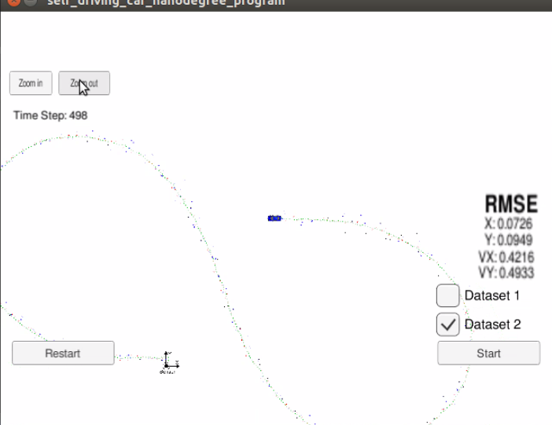

# Extended Kalman Filter Project
With start code from [Udacity EKF project.](https://github.com/udacity/CarND-Extended-Kalman-Filter-Project)

A useful tutorial can be found [here.](https://towardsdatascience.com/extended-kalman-filter-43e52b16757d)

EKF: Approximate non-linear function *g(x)* by first order Taylor expansion about g(*mu*), where *mu* is the mean of *x*.

## Data
Data are coming from the [simulator](https://github.com/udacity/self-driving-car-sim/releases).
The communication between the simulator and my program is done by uWebSocketIO which is installed with `./install-linux.sh`  
* Lidar
    * [x, y] in Cartesian coordinates
* Radar
    * [rho, phi, rho_dot] in Polar coordinates
    * Non-linear to the vehicle state space [x, y, x_dot, y_dot]

## Prediction step
same for both measurement sources

## Update step
Different sensor types call different update function.
 
### for Radar
* Mapping function **h(x)**:
    * Because we are predicting(*x* state vector) in Cartesian coordinates but our measurements(*z*) from **Radar** is in Polar coordinates;  
    * 
* Jacobian matrix **H_j**
    * first order derivatives in Taylor expansion
    * 
    
### for Lidar
* just use ordinary Kalman filter equations
    
    
    
## Results
* Here is a video showing my EKF on the simulator:

