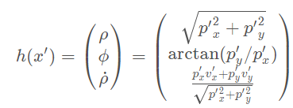

# Extended Kalman Filter Project
With start code from [Udacity EKF project.](https://github.com/udacity/CarND-Extended-Kalman-Filter-Project)

A useful tutorial can be found [here.](https://towardsdatascience.com/extended-kalman-filter-43e52b16757d)
* Approximate non-linear function *g(x)* by first order Taylor expansion about g(*mu*), where *mu* is the mean of *x*.

## Data
* Lidar
* Radar
    * [rho, phi, rho_dot] in Polar coordinate system 
    * Non-linear

## Update step
* Mapping function **h(x')**:
    * We are predicting(*x'*) in Cartesian coordinate system but our measurements(*z*) from **Radar** is in Polar coordinate system;  
    
* Jacobian matrix **H_j**

